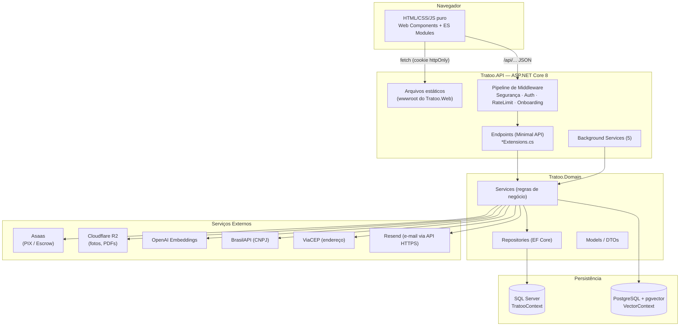
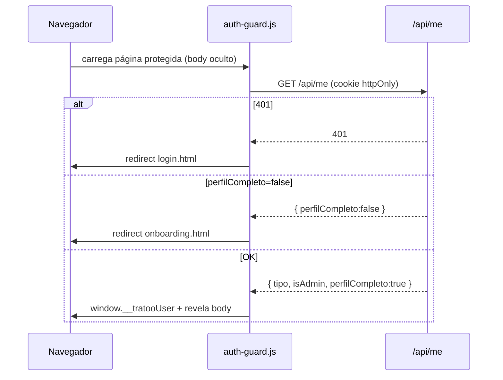
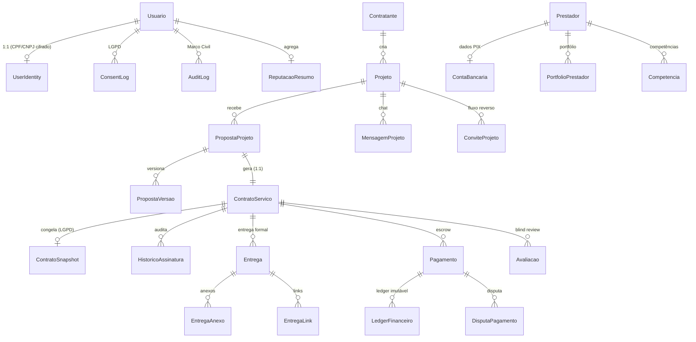
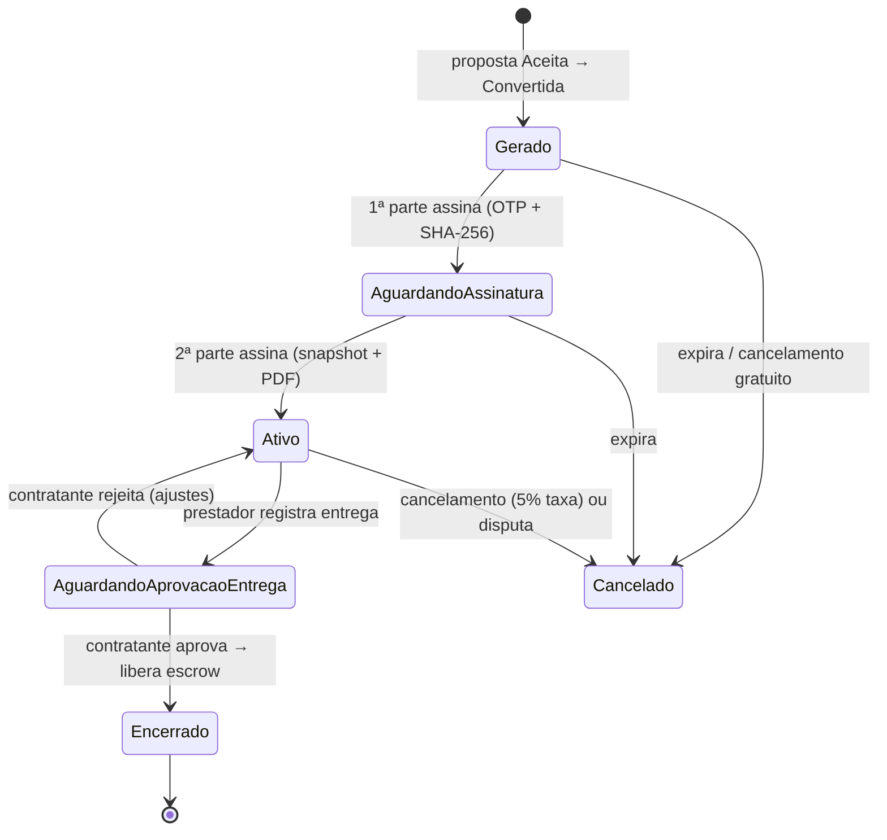
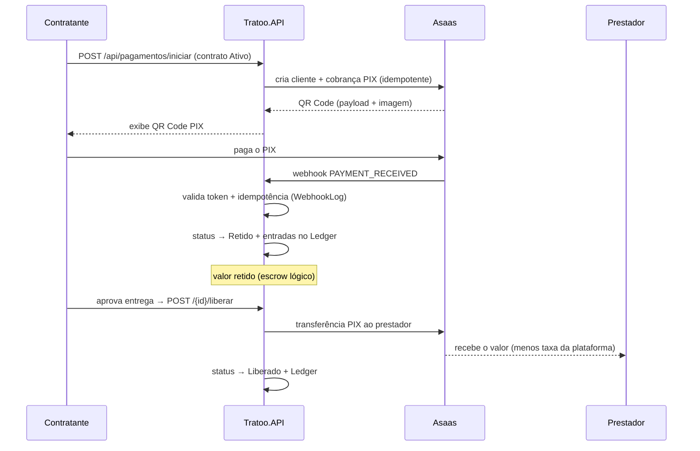
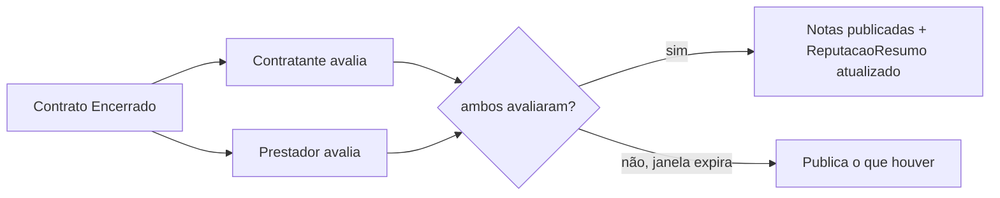
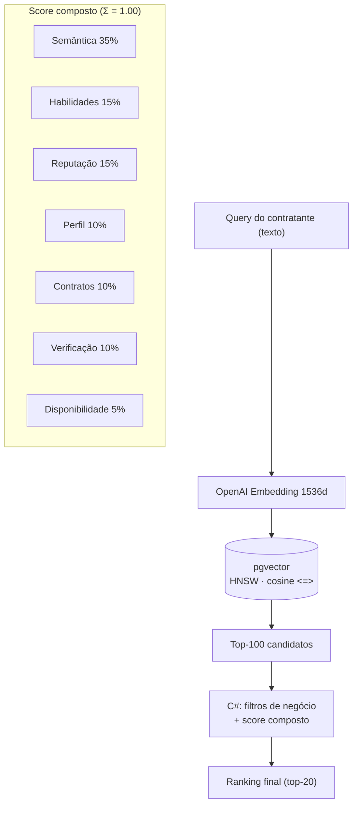

# Tratoo — Documentação Técnica de Arquitetura

> Referência técnica do sistema Tratoo — um marketplace de serviços que conecta
> **contratantes** e **prestadores** (freelancers), com fluxo completo de projetos,
> propostas, contratos com assinatura digital, pagamento em escrow via PIX,
> avaliação bilateral e busca semântica por IA.
>
> Público-alvo: desenvolvedores que precisam **entender, manter e explicar** o sistema.
> Última revisão: 2026-07-23.

---

## Sumário

1. [Arquitetura Geral](#1-arquitetura-geral)
2. [Frontend](#2-frontend)
3. [Backend & API](#3-backend--api)
4. [Banco de Dados](#4-banco-de-dados)
5. [Funcionalidades Técnicas](#5-funcionalidades-técnicas)
6. [Fluxos Críticos](#6-fluxos-críticos)
7. [Apêndices](#7-apêndices)

---

## 1. Arquitetura Geral

### 1.1 Visão macro

O Tratoo é organizado em uma **solution .NET 8 com três projetos**, seguindo separação
por responsabilidade. O frontend é HTML/CSS/JS puro (sem framework/bundler), servido
como arquivos estáticos pela própria API.

| Projeto | Tipo | Responsabilidade |
|---|---|---|
| **Tratoo.Domain** | Class Library | Núcleo de negócio: modelos, DTOs, repositórios, serviços, `DbContext`, validações. Organizado por *feature folders* (Vertical Slice). |
| **Tratoo.API** | ASP.NET Core (Minimal API) | Host HTTP: endpoints, middleware, autenticação, background services, implementações de gateways externos (Asaas, R2). Referencia `Tratoo.Domain`. |
| **Tratoo.Web** | ASP.NET Core (estático) | Frontend: `wwwroot` com HTML/CSS/JS. Em produção o `wwwroot` é servido diretamente pela `Tratoo.API`. |



### 1.2 Fluxo de dados (requisição → resposta)

O padrão de uma requisição autenticada de API:

```
Navegador
  │  fetch('/api/contratos/{id}', credentials: 'same-origin')
  │  → cookie httpOnly "tratoo_auth" (JWT) enviado automaticamente
  ▼
Middleware Pipeline (Program.cs)
  1. Security headers (CSP, X-Frame-Options...)
  2. UseAuthentication  → lê o JWT do cookie, popula HttpContext.User
  3. UseAuthorization   → valida .RequireAuthorization() / roles
  4. UseRateLimiter     → políticas por IP (login, cadastro, senha...)
  5. Guarda de onboarding → 403 se perfil incompleto
  ▼
Endpoint (Minimal API — ex.: ContratoExtensions.cs)
  → ExtrairUserId(http)  (ClaimsHelper lê ClaimTypes.NameIdentifier)
  → validação superficial do request
  ▼
Service (Tratoo.Domain — regra de negócio)
  → valida invariantes; lança NegocioException em violações
  ▼
Repository (EF Core)
  → TratooContext / VectorContext → SQL
  ▼
Resposta JSON  (Results.Ok / NotFound / BadRequest ...)
  → erros de negócio viram 400 { mensagem }; erros não tratados viram 500
```

### 1.3 Stack tecnológica e justificativas

| Camada | Tecnologia | Por quê |
|---|---|---|
| Runtime | **.NET 8** | LTS, performance, Minimal API enxuta. |
| Web | **ASP.NET Core Minimal API** | Endpoints declarativos, baixo boilerplate, ideal para APIs REST. |
| ORM | **EF Core 9** | Migrations, LINQ, mapeamento rico (TPT, owned types, conversões). |
| BD relacional | **SQL Server** | Consistência transacional para o núcleo de negócio (`TratooContext`). |
| BD vetorial | **PostgreSQL + pgvector** | Busca por similaridade (HNSW / distância de cosseno) para IA (`VectorContext`). |
| Auth | **JWT em cookie httpOnly** + **BCrypt** | Token não acessível a JS (mitiga XSS); BCrypt (lento por design) para senhas. |
| Cache | **MemoryCache** | OTPs de MFA e cadastro pendente (TTL curto, sem necessidade de store distribuído no MVP). |
| Pagamento | **Asaas (Sandbox)** | Gateway PIX brasileiro; abstraído por `IAsaasGatewayService`. |
| Storage | **Cloudflare R2** (S3-compatível) | Bucket público (fotos/portfólio) e privado (PDFs de contrato com URL pré-assinada). |
| IA | **OpenAI Embeddings** (`text-embedding-3-small`, 1536 dims) | Gera vetores para matching semântico prestador↔projeto. |
| PDF | **QuestPDF** | Geração do PDF do contrato assinado. |
| Logs | **Serilog** | Log estruturado em console + arquivo rotativo diário. |
| Docs | **Swagger / Swashbuckle** | Documentação interativa da API (somente em Development). |
| Validação externa | **BrasilAPI** (CNPJ) · **ViaCEP** (endereço) | Enriquecimento e verificação de identidade/endereço. |

### 1.4 Deploy

- **Dockerfile** na raiz (deploy no Railway). Em container, `Tratoo.Web/wwwroot` fica como
  pasta irmã e é servida pela API.
- Em **publish nativo** (ex.: Azure App Service Windows), o target MSBuild
  `CopyTratooWebWwwroot` ([Tratoo.API.csproj](../Tratoo.API/Tratoo.API.csproj)) copia o
  `wwwroot` para dentro do publish da API. O [Program.cs](../Tratoo.API/Program.cs)
  detecta em runtime qual caminho existe (irmão vs. local).

---

## 2. Frontend

### 2.1 Filosofia

HTML/CSS/JS **puro**, sem framework nem bundler. A consistência vem de três pilares
introduzidos no refactor de julho/2026 (ver [CONTRIBUTING.md](../Tratoo.Web/wwwroot/CONTRIBUTING.md)):

1. **Web Components** (Custom Elements nativos) para UI compartilhada.
2. **ES Modules** para todos os scripts de página.
3. **Design tokens** (CSS variables) + **BEM** para estilos.

### 2.2 Estrutura de pastas (`Tratoo.Web/wwwroot`)

```
wwwroot/
├── index.html                     # Landing
├── pages/                         # Uma pasta por feature
│   ├── auth/         (login, cadastro-cliente/prestador, onboarding, start)
│   ├── projetos/     (index = busca, detalhe)
│   ├── contratante/  (criar-projeto, meus-projetos, perfil, propostas-projeto...)
│   ├── prestador/    (buscar, perfil, minhas-propostas, meus-convites...)
│   ├── proposta/     (detalhe = negociação/chat)
│   ├── contrato/     (detalhe = assinatura/entrega)
│   ├── pagamento/    (detalhe = PIX/escrow)
│   ├── avaliacao/    (enviar)
│   ├── chat/         (index, detalhe)
│   ├── admin/        (disputas, disputa)
│   └── me/           (contratos)
├── components/                    # Fragmentos HTML (header-*, footer, cadastro)
└── assets/
    ├── css/  (base/ · components/ · pages/<feature>/)  ← tokens em base/variables.css
    └── js/
        ├── core/app.js            # Bootstrap único (registra Custom Elements, onReady)
        ├── services/api.js        # Wrapper central de fetch
        ├── components/            # tratoo-header.js, tratoo-footer.js (Custom Elements)
        ├── utils/                 # auth-guard.js, form.js
        └── pages/<feature>/       # Script por página (ES module)
```

### 2.3 Componentes (Web Components)

- `<tratoo-header>` e `<tratoo-footer>` são **Custom Elements** definidos em
  [assets/js/components/](../Tratoo.Web/wwwroot/assets/js/components/) e registrados
  de forma idempotente por [core/app.js](../Tratoo.Web/wwwroot/assets/js/core/app.js).
- Usam **Light DOM** (não Shadow DOM) de propósito: assim herdam o CSS global existente.
- O header varia por contexto (`header-publico`, `header-contratante`, `header-prestador`,
  `header-auth`) — o Custom Element decide qual conteúdo renderizar a partir de
  `window.__tratooUser`.

### 2.4 Contrato de inicialização — `onReady()`

Cada script de página importa e chama `onReady(initPage)` em vez de registrar seu próprio
listener de `DOMContentLoaded`. Isso padroniza o boot e evita depender da ordem de
inclusão de scripts:

```js
import { onReady } from '/assets/js/core/app.js';
import { api }     from '/assets/js/services/api.js';

onReady(async () => {
    const contrato = await api.get(`/api/contratos/${id}`);
    // render...
});
```

### 2.5 Comunicação com a API — `services/api.js`

Wrapper único sobre `fetch` ([api.js](../Tratoo.Web/wwwroot/assets/js/services/api.js)):

- Métodos: `get`, `post`, `put`, `patch`, `delete`, `uploadPost`, `uploadPut` (multipart).
- **`credentials: 'same-origin'`** em toda chamada → o cookie httpOnly do JWT viaja
  automaticamente. O frontend **nunca** manipula o token diretamente.
- Erros normalizados: rejeita com `{ status, data }` quando `!response.ok`.
- **Overlay de loading global** com debounce de 200 ms e contador de requisições
  concorrentes (só esconde quando todas terminam).

### 2.6 Roteamento e navegação

Não há SPA router. A navegação é **multipágina clássica** (cada `.html` é uma rota).
O controle de acesso acontece **por convenção de pasta** + guard:

- `/pages/contratante/*` → exclusivo de `Contratante`.
- `/pages/prestador/*` → exclusivo de `Prestador`.
- `/pages/admin/*` → exclusivo de `Admin`.

### 2.7 Autenticação e sessão no frontend — `auth-guard.js`

[auth-guard.js](../Tratoo.Web/wwwroot/assets/js/utils/auth-guard.js) é **script clássico
bloqueante** (carregado *antes* do módulo da página — de propósito, pois módulos são
`deferred` e permitiriam flash de conteúdo protegido). Fluxo:

1. Oculta o `<body>` (`visibility: hidden`) para evitar flash.
2. `GET /api/me` → lê os claims do JWT no cookie.
3. `401` → redireciona para `login.html`.
4. `perfilCompleto === false` → redireciona para `onboarding.html`.
5. Valida se a **role** do usuário tem acesso à pasta da página atual.
6. OK → expõe `window.__tratooUser` e revela o `<body>`.



---

## 3. Backend & API

### 3.1 Organização em camadas

O backend não usa Controllers MVC. Usa **Minimal API** com endpoints agrupados em
*extension methods* (`app.AddEndPoints*()`), registrados no
[Program.cs](../Tratoo.API/Program.cs). As camadas:

```
Endpoint (Tratoo.API/EndPoints/*Extensions.cs)
   │  autenticação, extração de claims, validação superficial, montagem de resposta HTTP
   ▼
Service (Tratoo.Domain/Features/<feature>/Services)
   │  regra de negócio, orquestração, transações, chamadas a gateways externos
   ▼
Repository (Tratoo.Domain/Features/<feature>/Repositories)
   │  acesso a dados via EF Core (consultas, persistência)
   ▼
DbContext (TratooContext / VectorContext) → SQL Server / PostgreSQL
```

A `Tratoo.Domain` adota **Vertical Slice / feature folders**: cada feature
(`Auth`, `Projetos`, `Propostas`, `Contratos`, `Pagamentos`, `Perfis`, `Mensagens`,
`IA`, `Storage`, `Infrastructure`, `Shared`) agrupa seus próprios `DTOs`,
`Repositories`, `Services` e `Validators`.

### 3.2 Padrão de um endpoint

Exemplo real ([ContratoExtensions.cs](../Tratoo.API/EndPoints/ContratoExtensions.cs)):

```csharp
app.MapGet("/api/contratos/{id:guid}", async (
    Guid id,
    HttpContext http,
    IContratoServicoService service) =>
{
    var userId = ExtrairUserId(http);          // ClaimsHelper → ClaimTypes.NameIdentifier
    if (userId == null) return Results.Unauthorized();

    var dto = await service.ObterDetalheAsync(id, userId.Value);
    return dto == null ? Results.NotFound() : Results.Ok(dto);
}).RequireAuthorization();
```

Convenções observáveis:

- **Injeção por parâmetro** do endpoint (o Minimal API resolve serviços do DI).
- **`ExtrairUserId(http)`** ([ClaimsHelper.cs](../Tratoo.API/EndPoints/ClaimsHelper.cs))
  centraliza a leitura do id do usuário a partir dos claims.
- **`.RequireAuthorization()`** / **`.RequireRateLimiting("politica")`** encadeados.
- Uploads usam `multipart/form-data` + `.DisableAntiforgery()` e validam
  extensão/tamanho no servidor (o `Content-Type` é derivado da extensão, nunca do cliente).

### 3.3 Segurança

**Autenticação (JWT via cookie httpOnly).** Configurada em [Program.cs](../Tratoo.API/Program.cs):

- O `JwtBearerEvents.OnMessageReceived` extrai o token do cookie `tratoo_auth`
  (em vez do header `Authorization`).
- `TokenValidationParameters` valida issuer, audience, assinatura (`SymmetricSecurityKey`)
  e lifetime com **`ClockSkew = TimeSpan.Zero`** (sem tolerância de expiração).

**Autorização (roles/claims).** Três políticas de role: `Prestador`, `Contratante`,
`Admin`. O claim de tipo é emitido como **`ClaimTypes.Role`** (permite `RequireRole`
e leitura consistente em `/api/me`).

**Rate limiting** (Fixed Window por IP):

| Política | Limite | Aplica-se a |
|---|---|---|
| `cadastro` | 5/min | Endpoints de cadastro |
| `login` | 10/min | Login e MFA (brute-force) |
| `senha` | 3/min | Redefinição de senha |
| `dados-bancarios` | 5/min | Fluxo de dados bancários |
| `otp-assinatura` | 3/min | Solicitação de OTP para assinar contrato |

Rejeição → `429` com `{ mensagem }`.

**Cabeçalhos de segurança.** Middleware global aplica `X-Content-Type-Options`,
`X-Frame-Options: DENY`, `Referrer-Policy`, `Permissions-Policy` e um **CSP** restritivo
(`default-src 'self'`, `object-src 'none'`, `frame-ancestors 'none'`). `HSTS` em produção.

> Nota: o CSP ainda permite `'unsafe-inline'` para script/style porque o frontend usa
> handlers e estilos inline. Endurecer para *nonces* é melhoria futura sem impacto funcional.

**Guarda de onboarding.** Middleware que, para usuário autenticado com
`perfilCompleto != "true"`, bloqueia (`403 ONBOARDING_PENDENTE`) qualquer rota de API
exceto as isentas (`/api/me`, `/usuarios/onboarding`, `logout`, `login`, `cadastro`,
`senha/resetar`, `swagger`, `/api/cep/`). Detalhe importante: como o cookie viaja em
**toda** requisição same-origin, rotas públicas precisam ser explicitamente isentas.

### 3.4 Tratamento de erros

Estratégia centralizada em `UseExceptionHandler` ([Program.cs](../Tratoo.API/Program.cs)):

- **`NegocioException`** (erro de regra de negócio, esperado) → **HTTP 400** com
  `{ mensagem }` legível ao usuário. Serviços lançam essa exceção para violações de
  invariante (ex.: "Usuário ou senha inválidos").
- Qualquer outra exceção → **HTTP 500** com mensagem genérica + log `LogError` (Serilog).
  Detalhes internos nunca vazam ao cliente.

Isso mantém os endpoints limpos: eles não precisam de `try/catch` — apenas lançam ou
deixam propagar.

### 3.5 Background Services

Cinco serviços hospedados ([BackgroundServices/](../Tratoo.API/BackgroundServices/)):

| Serviço | Função |
|---|---|
| `PropostaExpiracaoService` | Expira propostas não respondidas no prazo. |
| `ContratoExpiracaoService` | Cancela contratos não assinados dentro do prazo (`ExpiraEm`). |
| `PagamentoLiberacaoService` | Auto-libera escrow quando `LiberacaoAutomaticaEm <= agora`. |
| `AvaliacaoExpiracaoService` | Encerra janelas de avaliação (blind review) vencidas. |
| `ReindexacaoBackgroundService` | Recalcula embeddings em lote (segunda, 02:00 UTC). |

---

## 4. Banco de Dados

### 4.1 Dois contextos, dois bancos

- **`TratooContext`** (SQL Server) — núcleo transacional do negócio.
  [TratooContext.cs](../Tratoo.Domain/Data/TratooContext.cs).
- **`VectorContext`** (PostgreSQL + pgvector) — embeddings vetoriais para busca semântica.
  Índices **HNSW** criados no startup por `VectorDbInitializer`.

### 4.2 Herança de `Usuario` — TPT

`Usuario` é uma classe **abstrata** base; `Prestador` e `Contratante` herdam dela.
O mapeamento é **TPT (Table Per Type)** — cada tipo concreto tem sua própria tabela:

```csharp
modelBuilder.Entity<Prestador>().ToTable("Prestadores");
modelBuilder.Entity<Contratante>().ToTable("Contratantes");
```

> Atenção: há um comentário legado "TPH" no código, mas a configuração real
> (`.ToTable()` por tipo) é **TPT**. Campos comuns (Email único, `Endereco` como
> *owned type*, `Status` como string, `DataCadastro` com default `GETUTCDATE()`) ficam
> na tabela base `Usuarios`.

### 4.3 Principais entidades e relacionamentos



### 4.4 Decisões de design (mapeamento)

- **Valores monetários**: `HasPrecision(18, 2)` em todo campo `decimal`
  (`ValorBruto`, `OrcamentoMin/Max`, `Valor` do ledger, etc.).
- **Enums como string**: `HasConversion<string>()` na maioria (`Status`, `Categoria`,
  `Metodo`...) → legível no banco; alguns como int (`NivelVerificacao`, `Avaliacao.Status`).
- **Timestamps de criação**: default `GETUTCDATE()` no banco (`CriadoEm`, `RecebidoEm`,
  `CongeladoEm`...).
- **Idempotência financeira**: índices **únicos** em `Pagamento.IdempotencyKey` e
  `WebhookLog.ChaveIdempotencia` → evita cobranças/processamentos duplicados.
- **Ledger imutável**: `LedgerFinanceiro` nunca é atualizado — só inserções (append-only)
  com `CriadoEm` default no banco.
- **Soft delete**: `Usuario.ExcluidoEm` (LGPD Art. 18) e `EntregaAnexo.ExcluidoEm` com
  **query filter global** (`HasQueryFilter(a => a.ExcluidoEm == null)`).
- **Unicidade de negócio**: `ContratoServico.PropostaId` único (1 contrato por proposta);
  `Avaliacao (ContratoServicoId, AvaliadorId)` único (1 avaliação por parte por contrato);
  `PropostaVersao (PropostaId, Versao)` único.
- **`DeleteBehavior.Restrict`** predominante entre agregados (evita cascatas destrutivas e
  ciclos); `Cascade` apenas onde o filho não existe sem o pai (versões, ledger, anexos,
  snapshot).

### 4.5 Migrations

Gerenciadas por EF Core no projeto `Tratoo.Domain`. Marcos relevantes:

| Migration | Conteúdo |
|---|---|
| `AddProjetoEPropostaProjeto` | Projetos e propostas (US-04/05/06). |
| `AddContratoServico` | Contratos + snapshot + assinatura. |
| `AddPagamentoEscrowCompleto` | Pagamento, ledger, disputa, webhook log. |
| `AddCancelamentoColunas` | Colunas de cancelamento de contrato + entrega registrada. |
| `AddEmbeddingsSemanticos` | Tabelas de embeddings (evoluiu depois para pgvector). |

> Comando: `dotnet ef database update` a partir do projeto `Tratoo.Domain`.

---

## 5. Funcionalidades Técnicas

Para cada feature: fluxo, entidades, endpoints, regras e pontos de segurança.

### 5.1 Cadastro e Identidade (LGPD)

**Fluxo.** Cadastro em duas etapas: (1) dados básicos → guardados em `MemoryCache`
(cadastro pendente); (2) confirmação por código enviado ao e-mail → cria o `Usuario` com
`Status = Active` e grava `ConsentLog`. **CPF/CNPJ não são pedidos no cadastro** — só na
1ª proposta/contrato, via `IdentidadeService`.

**Entidades.** `Usuario` (base), `UserIdentity` (CPF/CNPJ **cifrado AES-256**),
`ConsentLog`, `AuditLog`. Ver [Usuario.cs](../Tratoo.Domain/Domain/Models/Usuario.cs).

**Regras/Segurança.**
- Senha: mínimo 8 caracteres + 1 número (BCrypt para o hash).
- CPF validado localmente; CNPJ via **BrasilAPI**.
- `NivelVerificacao ≥ Identidade` é pré-requisito para publicar projeto/gerar contrato.
- **Nunca** retornar CPF/CNPJ em respostas de API.
- Exclusão de conta (Art. 18): anonimiza nome/e-mail, remove `UserIdentity`, **preserva**
  contratos/pagamentos/avaliações por obrigação legal (`ExcluidoEm` marca soft delete).

### 5.2 Login e Autenticação (JWT + MFA)

**Fluxo.** `POST /usuarios/login` → valida credenciais → se `MFA`, envia OTP e retorna
`RequerMFA` (sem emitir cookie); senão emite o JWT no cookie. `POST /usuarios/login/mfa`
valida o OTP e emite o cookie. Ver
[LoginService.cs](../Tratoo.Domain/Features/Auth/Services/LoginService.cs).

**Segurança (defesa contra timing/enumeração).**
- BCrypt **sempre** executa — com `PasswordHasher.DummyHash` quando o e-mail não existe —
  normalizando o tempo de CPU (elimina *side-channel* de enumeração).
- `Stopwatch` + `Task.Delay` garantem **mínimo de 300 ms** em todos os caminhos.
- OTPs usam `SecureHasher` (SHA-256 + `FixedTimeEquals`) — BCrypt é desnecessário para
  código de 6 dígitos com TTL curto.
- Rate limiting `login` (10/min por IP).
- Checagem de `Status` (`Pending` → confirmar e-mail; `Blocked` → suporte) após validar senha.

### 5.3 Reset de Senha

**Fluxo.** `solicitar` (envia OTP) → `resetar` (valida OTP, aplica nova senha).

**Anti-enumeração.** A resposta é **idêntica** exista ou não a conta; o código só é
enviado se o usuário existe e está `Active`. Erro genérico "Código inválido ou expirado."
não distingue e-mail inexistente de código errado. Rate limit `senha` (3/min). OTP de uso
único (removido do cache ao validar).

### 5.4 Gestão de Projetos

**Fluxo.** Contratante cria projeto (nasce **Rascunho**) → publica (`Aberto`). Prestadores
buscam com filtros + paginação.

**Entidades.** `Projeto` (orçamento min/max, categoria, habilidades em JSON, visibilidade,
nível, idioma, status). Ver [Projeto.cs](../Tratoo.Domain/Domain/Models/Projeto.cs).

**Endpoints.** `GET /api/projects` (busca pública), `GET /api/projects/{id}`,
`POST /api/projects` (rascunho), `POST /api/projects/{id}/publish`,
`DELETE /api/projects/{id}`, `GET /api/me/projects`, `GET /api/projects/{id}/proposals`,
`POST /api/projects/{id}/proposals`.

**Regras.** Publicar exige `NivelVerificacao ≥ Identidade`. Ao publicar, dispara indexação
de embedding (busca semântica).

### 5.5 Propostas e Negociação

**Fluxo.** Prestador envia proposta (`PropostaProjeto`); negociação por **versões**
(`PropostaVersao`) e **chat** (`MensagemProjeto`) atrelado ao par (projeto, prestador).
Há também **fluxo reverso**: contratante convida prestador (`ConviteProjeto`), que pode
originar uma proposta (`SenderType`/`ConviteId`).

**Estados** (`StatusPropostaProjeto`): `Draft → Submitted → Negotiating → Accepted →
Converted` (ou `Recusada`/`Cancelada`).

**Segurança.** Chat isolado por índice composto `(ProjetoId, PrestadorId, EnviadoEm)` —
cada prestador só vê a própria conversa com o contratante.

### 5.6 Contratos e Assinatura Digital

Detalhado em [§6.1](#61-ciclo-de-vida-de-um-contrato).

**Entidades.** `ContratoServico` (JSON editável, hash SHA-256, PDF key, dados de
assinatura por parte), `ContratoSnapshot` (imutável), `HistoricoAssinatura` (IP/UA).
Ver [ContratoServico.cs](../Tratoo.Domain/Domain/Models/ContratoServico.cs).

**Segurança.** Assinatura exige **OTP por e-mail** (`solicitar-otp` + `assinar`), confirma
IP/User-Agent, e computa SHA-256 do conteúdo (prova de integridade — MP 2.200-2/2001).
PDF fica em **bucket privado** do R2, acessível só por **URL pré-assinada** (15 min) às partes.

### 5.7 Entrega Formal

**Fluxo.** Prestador registra entrega (`POST /api/contratos/{id}/entrega`, multipart) com
descrição, links e anexos (upload ao **R2 privado**). Contratante aprova
(`.../entrega/aprovar` → libera escrow) ou rejeita (`.../entrega/rejeitar` → ajustes).

**Validação de upload.** Máx. 10 arquivos, 20 MB cada, extensões permitidas
(`pdf/doc/docx/xls/xlsx/jpg/png/zip`); `Content-Type` derivado da extensão no servidor.

### 5.8 Pagamento e Escrow

Detalhado em [§6.2](#62-fluxo-de-pagamento-com-escrow).

**Entidades.** `Pagamento` (Asaas IDs, PIX QR Code, idempotência), `LedgerFinanceiro`
(imutável), `DisputaPagamento`, `WebhookLog`. Ver
[Pagamento.cs](../Tratoo.Domain/Domain/Models/Pagamento.cs).

**Abstração.** Gateway isolado por `IAsaasGatewayService` — trocar de provedor = nova
implementação. Toda rastreabilidade fica no ledger append-only.

### 5.9 Avaliações (Blind Review)

**Fluxo.** Ao encerrar o contrato, abre-se janela de avaliação bilateral. Cada parte
avalia a outra; as notas só ficam **visíveis quando ambas avaliam** ou quando a janela
expira (`AvaliacaoExpiracaoService`) — evita retaliação.

**Entidades.** `Avaliacao` (1 por parte por contrato — índice único), `ReputacaoResumo`
(agregado por usuário: `MediaGeral` `HasPrecision(4,2)`).

**Privacidade.** `Usuario.AvaliacoesPrivado` oculta avaliações publicamente.

### 5.10 Busca Semântica por IA

Detalhado em [§6.5](#65-busca-semântica).

**Arquitetura em duas camadas.** (1) **pgvector** retorna top-100 por distância de cosseno
(HNSW); (2) **C#** filtra por regras de negócio e aplica **score composto**. Ver
[BuscaSemanticaService.cs](../Tratoo.Domain/Features/IA/Services/BuscaSemanticaService.cs).

**Indexação.** OpenAI Embeddings gera o vetor **uma vez** no cadastro/atualização
(hooks após `SaveAsync` em perfil, competências, experiências, certificações, portfólio,
e ao publicar projeto). Reindexação em lote semanal. Há **fallback** para busca por
palavras-chave se o serviço de IA estiver indisponível.

---

## 6. Fluxos Críticos

### 6.1 Ciclo de vida de um contrato



1. **Geração.** Ao aceitar uma `PropostaProjeto`, ela vira `Convertida` e nasce um
   `ContratoServico` com status `Gerado`. Pré-requisitos: ambas as partes com
   `NivelVerificacao ≥ Identidade` e endereço (cidade+estado) preenchido.
2. **Conteúdo.** `ConteudoJson` é editável **apenas** enquanto `Gerado`. CPF/CNPJ é
   mascarado no JSON (LGPD).
3. **1ª assinatura.** Requer OTP; computa **SHA-256** do `ConteudoJson` (`ConteudoHash`),
   registra IP/UA, status → `AguardandoAssinatura`.
4. **2ª assinatura.** Cria `ContratoSnapshot` **imutável**, gera **PDF** (QuestPDF) no R2
   privado, status → `Ativo`.
5. **Expiração.** `ExpiraEm = CriadoEm + 7 dias`; o `ContratoExpiracaoService` cancela
   contratos não assinados no prazo.

### 6.2 Fluxo de pagamento com escrow



- **Escrow lógico**: o valor fica `Retido` até aprovação da entrega. Taxa da plataforma:
  **10%** (constante em `PagamentoService`). A `TaxaGateway` (Asaas) é apenas informativa.
- **Auto-liberação**: `PagamentoLiberacaoService` libera quando
  `LiberacaoAutomaticaEm <= agora` (prazo de entrega + 7 dias de carência).
- **Webhook idempotente**: `POST /api/webhooks/asaas` valida token e usa
  `WebhookLog.ChaveIdempotencia` (índice único) para não processar duas vezes.
- **Estorno**: possível antes da liberação (`POST /{id}/estornar`).

### 6.3 Cancelamento de contrato (3 situações)

| Situação | Estado | Custo | Efeito |
|---|---|---|---|
| 1 | `Gerado` / `AguardandoAssinatura` (sem dinheiro) | **Grátis** | Projeto reabre; proposta → Recusada. |
| 2 | `Ativo`, **sem** entrega registrada | **5% taxa** + 95% reembolso | Estorno parcial via Asaas. |
| 3 | `Ativo`, **com** entrega registrada | **Bloqueado** | Obrigatório abrir **disputa**. |

Endpoint único `DELETE /api/contratos/{id}?motivo=...` valida a situação internamente.

### 6.4 Avaliação e reputação



Blind review evita retaliação: nenhuma nota aparece até ambas as partes avaliarem
(ou a janela expirar). `ReputacaoResumo` mantém o agregado consultado publicamente.

### 6.5 Busca semântica



Se a query for vazia ou o serviço de IA falhar, o sistema faz **fallback** para busca por
palavras-chave, preservando os filtros e o restante do score.

---

## 7. Apêndices

### 7.1 Mapa de endpoints (registro no Program.cs)

Todos os grupos são registrados via extension methods no
[Program.cs](../Tratoo.API/Program.cs):

```
AddEndPointsCep · AddEndPointsCompetencias · AddEndPointsUsers · AddEndPointsPerfil
AddEndPointsDadosBancarios · AddEndPointsContratante · AddEndPointsCompetenciaRelacionamento
AddEndPointsProjeto · AddEndPointsProposta · AddEndPointsContrato · AddEndPointsPagamento
AddEndPointsAvaliacao · AddEndPointsConviteProjeto · AddEndPointsChatConvite
AddEndPointsBusca · AddEndPointsAdminDisputa · AddEndPointsDevSeed
```

### 7.2 Serviços externos e configuração

| Serviço | Config (appsettings) | Uso |
|---|---|---|
| SQL Server | `ConnectionStrings:DefaultConnection` | Núcleo de negócio. |
| PostgreSQL | `ConnectionStrings:VectorConnection` | Embeddings (pgvector). |
| JWT | `Jwt:SecretKey/Issuer/Audience` | Assinatura/validação do token. |
| Asaas | `Asaas:*` (+ `WebhookToken`) | PIX / escrow. |
| OpenAI | `OpenAI:BaseUrl/ApiKey` | Embeddings. |
| Cloudflare R2 | `CloudflareR2` (público) · `CloudflareR2Private` (privado) | Fotos/portfólio · PDFs. |
| E-mail | `Email:*` | OTP, notificações. |

### 7.3 Convenções para manutenção

- **Regra de negócio nova** → serviço em `Tratoo.Domain/Features/<feature>/Services`;
  lançar `NegocioException` para violações (vira 400 automaticamente).
- **Endpoint novo** → método em `*Extensions.cs`, registrar no `Program.cs`, usar
  `ExtrairUserId(http)` e `.RequireAuthorization()`.
- **Nunca** expor CPF/CNPJ, telefone ou dados bancários em respostas públicas.
- **Dinheiro** sempre `decimal` com `HasPrecision(18,2)`; **ledger** é append-only.
- **Frontend**: novo script de página = ES module com `onReady()`; toda I/O via
  `services/api.js`; seguir BEM + design tokens (ver
  [CONTRIBUTING.md](../Tratoo.Web/wwwroot/CONTRIBUTING.md)).

---

*Documento gerado a partir da leitura direta do código-fonte. Ao alterar fluxos de
autenticação, pagamento ou contrato, atualize as seções correspondentes.*
